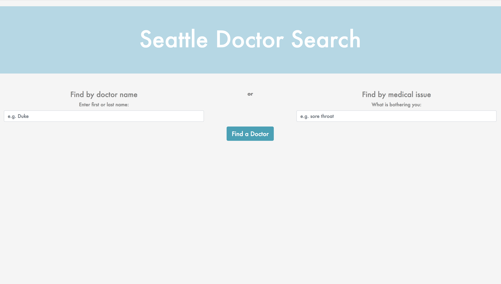

# Doctor Lookup

#### Epicodus Spring 2018

#### By **Nanette Girzi**

## Description

First application that allows a user to search for doctors by name or medical issue.

_ The home page of the application.

_ Doctor name search for Smith

## Setup/Installation Requirements

* $ clone this repo
* $ Go to www.developer.betterdoctor.com.org and login/create an account
* $ Get an API key
* $ Create a .env file in the root folder with API_KEY=[Your API_Key goes here]
* $ cd to DoctorLookup
* $ npm install
* $ npm run start

## Specifications

* User can enter a medical issue and get a list of doctors in Seattle
* User can enter a doctors name and get a list of doctors with that name
* If the API results in an error, the application will return a notification stating there was an error
* If the query response doesn't include any doctors, the application will return a notification that no doctors meet the criteria.

## Known Bugs

No known bugs at this time.

## Support and contact details

If you have suggestions please email ngirzi@gmail.com

## Technologies Used

* JavaScript
* CSS
* HTML
* Bootstrap
* Node
* Webpack
* BetterDoctor API

### License

*This software is licensed under the MIT license.*

Copyright (c) 2018 **Nanette Girzi**
